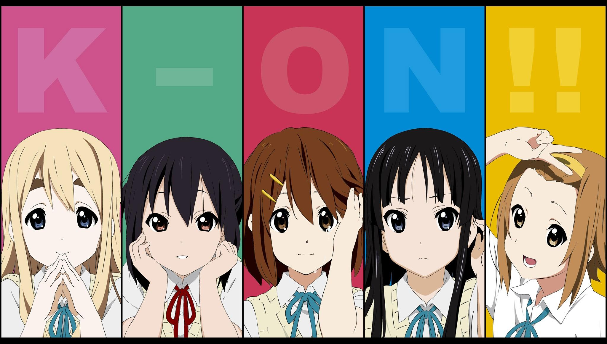

<div align="center">
  
</div>

<div align="center">
  
# 🚀 Welcome to My Digital Universe


---

## 🌌 Neural Network Status

<div style="display: flex; justify-content: space-around; margin: 20px 0;">
  
  
</div>

## 🧠 Code Matrix


---

## 🛸 Technology Arsenal

<div align="center">
  
### 🤖 AI & Machine Learning


### 💻 Development Stack


### 🗄️ Data & Cloud


</div>

---

## 📊 Real-time Activity Matrix

<div align="center">
  
### 🔥 Contribution Heatmap


### ⚡ Dynamic Metrics


<div style="display: flex; justify-content: space-around; margin: 20px 0;">
  
  
</div>

<div style="display: flex; justify-content: space-around; margin: 20px 0;">
  
  
</div>

</div>

---

## 🎯 Current Mission Objectives

<div align="center">
  
```ascii
╔══════════════════════════════════════════════════════════════╗
║  🚀 ACTIVE PROJECTS                                          ║
╠══════════════════════════════════════════════════════════════╣
║  🤖 Computer Vision for Satellite Image Analysis            ║
║  🧠 Deep Learning Model Optimization                        ║
║  🌐 Open Source AI Tools Development                        ║
║  📊 Real-time Data Processing Pipeline                      ║
╚══════════════════════════════════════════════════════════════╝
```

</div>

---

## 🌟 Featured Repositories

<div align="center">
  
[](https://github.com/LXZrivendell/lxz_rCore_24S
)
[](https://github.com/LXZrivendell/ai-sec-eval-pltf)

</div>

---

## 🎮 Achievement Unlocked

<div align="center">
  


</div>

---

## 📡 Connect to My Network

<div align="center">
  
[](https://linkedin.com/in/YOUR_LINKEDIN)
[](https://twitter.com/YOUR_TWITTER)
[](mailto:YOUR_EMAIL)
[](https://YOUR_PORTFOLIO_URL)

</div>

---

<div align="center">
  
### 💫 "Code is poetry, AI is the future, and together we build tomorrow."


</div>
